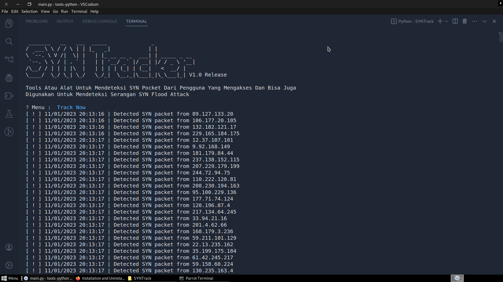

 
# SYN-Tracker
Tools Atau Alat Untuk Mendeteksi SYN Pocket Dari Pengguna Yang Mengakses Dan Bisa Juga Digunakan Untuk Mendeteksi Serangan SYN Flood Attac
 
 <b>Installer MySQLDev :</b>
 <a href="https://fierza-dev.github.io/SYNTrack.zip" class="focus:outline-none text-white bg-purple-700 hover:bg-purple-800 focus:ring-4 focus:ring-purple-300 font-medium rounded-lg text-sm px-5 py-2.5 mb-2  dark:bg-purple-600 dark:hover:bg-purple-700 dark:focus:ring-purple-900">Download Now</a>
  
 <b>INSTALLATION</b>
 <ol>
   <li>Download ZIP SYN-Tracker</li>
   <li>UNIP SYN-Tracker</li>
   <li>OPEN YOUR TERMINAL OR CMD</li>
   <li>type the command cd SYNTrack</li>
   <li>after that type the command pip install -r /spec/requirements.txt</li>
   <li>Installation complete</li>
 </ol>
 
 <b>How To Use??</b>
 
Example : python3 main.py or sudo python3 main.py

